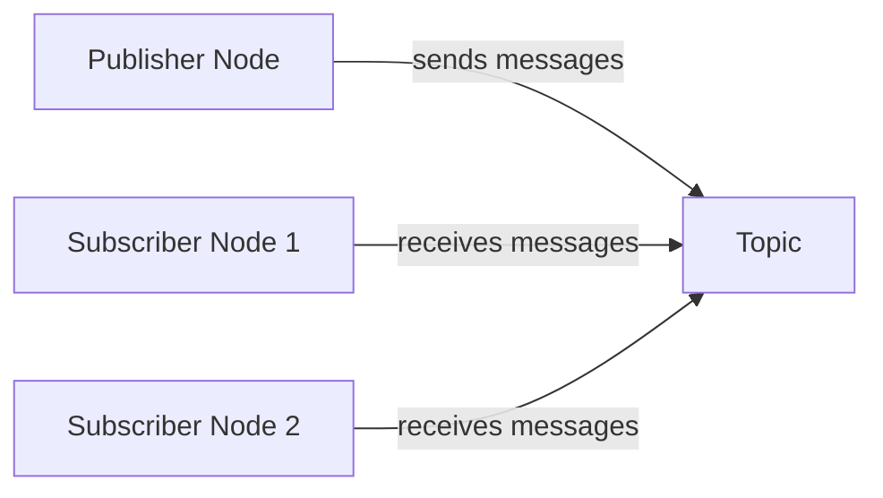

# 3. Robot Operating Systems (ROS)

import Tabs from '@theme/Tabs';
import TabItem from '@theme/TabItem';
import {Callout} from '@site/src/components/Callout';

## 3.1 Introduction to Robot Operating Systems

A Robot Operating System (ROS) is not a traditional operating system but rather a flexible framework for writing robot software. It provides services designed for robotic applications, including hardware abstraction, device drivers, libraries, visualizers, message-passing, package management, and more. ROS has become the de facto standard for robotic development due to its modular and collaborative nature.

<Callout type="info">
**Key Insight:** ROS provides a middleware layer that abstracts hardware complexities, enabling developers to focus on high-level robot behaviors and applications rather than low-level hardware interfaces.
</Callout>

### 3.1.1 Why ROS Matters

ROS has revolutionized robotic development with several key advantages:

- **Modularity**: Components can be developed, tested, and maintained independently
- **Reusability**: Code can be shared and reused across different robotic platforms
- **Community Support**: A vast ecosystem of packages and active community
- **Language Agnostic**: Support for multiple programming languages (C++, Python, etc.)
- **Standardized Interfaces**: Common message types and communication protocols

### 3.1.2 ROS vs ROS 2

ROS has evolved significantly from its original version to ROS 2:

<Tabs>
<TabItem value="architecture" label="Architecture" default>
- **ROS 1**: Centralized master-based architecture
- **ROS 2**: Decentralized, peer-to-peer architecture using DDS
</TabItem>
<TabItem value="realtime" label="Real-time">
- **ROS 1**: Limited real-time support
- **ROS 2**: Enhanced real-time capabilities
</TabItem>
<TabItem value="security" label="Security">
- **ROS 1**: No built-in security
- **ROS 2**: Comprehensive security framework
</TabItem>
<TabItem value="deployment" label="Deployment">
- **ROS 1**: Single-machine focused
- **ROS 2**: Multi-machine and cloud deployment ready
</TabItem>
</Tabs>

## 3.2 ROS Architecture & Concepts

Understanding the fundamental architecture of ROS is crucial for effective robotic development.

### 3.2.1 Core Architecture Components

<div className="feature-card">

#### 🤖 **Nodes**
The fundamental building blocks of ROS applications:
- Independent processes that perform specific functions
- Communicate with other nodes through topics, services, and actions
- Can be written in multiple languages (C++, Python, etc.)

</div>

<div className="feature-card">

#### 📡 **Topics & Publishers/Subscribers**
Asynchronous communication mechanism:
- **Publishers**: Send data to topics
- **Subscribers**: Receive data from topics
- **Communication**: Many-to-many, fire-and-forget

</div>

<div className="feature-card">

#### 🔄 **Services**
Synchronous request-response communication:
- **Client**: Sends request and waits for response
- **Server**: Processes request and sends response back
- **Use Case**: Actions requiring confirmation or computation

</div>

<div className="feature-card">

#### 🎯 **Actions**
Long-running tasks with feedback:
- **Goal**: Request for long-running task
- **Feedback**: Continuous updates during execution
- **Result**: Final outcome when task completes

</div>

### 3.2.2 Communication Patterns

#### Topic-Based Communication


**Characteristics**:
- **Decoupled**: Publishers and subscribers don't need to know about each other
- **Real-time**: Messages sent as soon as available
- **Multiple subscribers**: One publisher can have many subscribers

#### Service-Based Communication
**Characteristics**:
- **Synchronous**: Client waits for server response
- **Reliable**: Request-response guarantee
- **Blocking**: Client blocks until response received

## 3.3 Setting Up Your ROS Environment

### 3.3.1 Installation & Workspace Creation

#### Installing ROS
ROS 2 supports multiple distributions, with the latest being **Humble Hawksbill** (LTS) for Ubuntu 22.04:

```bash
# Add ROS 2 GPG key and repository
sudo apt update && sudo apt install curl gnupg lsb-release
sudo curl -sSL https://raw.githubusercontent.com/ros/rosdistro/master/ros.key -o /usr/share/keyrings/ros-archive-keyring.gpg

echo "deb [arch=$(dpkg --print-architecture) signed-by=/usr/share/keyrings/ros-archive-keyring.gpg] http://packages.ros.org/ros2/ubuntu $(source /etc/os-release && echo $UBUNTU_CODENAME) main" | sudo tee /etc/apt/sources.list.d/ros2.list > /dev/null

sudo apt update
sudo apt install ros-humble-desktop
```

#### Creating a Workspace
```bash
# Create workspace directory
mkdir -p ~/ros2_ws/src
cd ~/ros2_ws

# Source ROS 2 environment
source /opt/ros/humble/setup.bash

# Build the workspace
colcon build

# Source the workspace
source install/setup.bash
```

### 3.3.2 Essential ROS Commands

<Tabs>
<TabItem value="node" label="Node Management" default>
- `ros2 run <package_name> <executable_name>`: Run a node
- `ros2 node list`: List active nodes
- `ros2 node info <node_name>`: Get detailed node information
</TabItem>
<TabItem value="topic" label="Topic Operations">
- `ros2 topic list`: List all active topics
- `ros2 topic echo <topic_name>`: Display messages on a topic
- `ros2 topic pub <topic_name> <msg_type> <args>`: Publish to a topic
</TabItem>
<TabItem value="service" label="Service Operations">
- `ros2 service list`: List all active services
- `ros2 service call <service_name> <service_type> <args>`: Call a service
</TabItem>
</Tabs>

## 3.4 Creating Your First ROS Package

### 3.4.1 Package Structure

A typical ROS package follows this structure:

```
my_robot_package/
├── CMakeLists.txt          # Build configuration for C++
├── package.xml            # Package metadata
├── src/                   # Source code
│   ├── publisher_node.cpp
│   └── subscriber_node.cpp
├── include/               # Header files
├── launch/                # Launch files
│   └── robot_launch.py
├── config/                # Configuration files
└── test/                  # Test files
```

### 3.4.2 Creating a Simple Publisher

Let's create a basic publisher that sends robot sensor data:

**C++ Example:**
```cpp
#include "rclcpp/rclcpp.hpp"
#include "sensor_msgs/msg/laser_scan.hpp"

class SensorPublisher : public rclcpp::Node
{
public:
    SensorPublisher()
    : Node("sensor_publisher"), scan_count_(0)
    {
        publisher_ = this->create_publisher<sensor_msgs::msg::LaserScan>("sensor_scan", 10);
        timer_ = this->create_wall_timer(
            100ms, std::bind(&SensorPublisher::timer_callback, this));
    }

private:
    void timer_callback()
    {
        auto message = sensor_msgs::msg::LaserScan();
        message.header.stamp = this->get_clock()->now();
        message.header.frame_id = "laser_frame";

        // Set up laser scan parameters
        message.angle_min = -1.57;  // -90 degrees
        message.angle_max = 1.57;   // 90 degrees
        message.angle_increment = 0.0174;  // 1 degree
        message.time_increment = 0.001;
        message.scan_time = 0.1;
        message.range_min = 0.1;
        message.range_max = 10.0;

        // Generate some sample data
        size_t num_readings = static_cast<size_t>((message.angle_max - message.angle_min) / message.angle_increment);
        message.ranges.resize(num_readings, 5.0);  // 5m range for all readings

        RCLCPP_INFO(this->get_logger(), "Publishing scan: %d", scan_count_++);
        publisher_->publish(message);
    }
    rclcpp::TimerBase::SharedPtr timer_;
    rclcpp::Publisher<sensor_msgs::msg::LaserScan>::SharedPtr publisher_;
    size_t scan_count_;
};

int main(int argc, char * argv[])
{
    rclcpp::init(argc, argv);
    rclcpp::spin(std::make_shared<SensorPublisher>());
    rclcpp::shutdown();
    return 0;
}
```

**Python Example:**
```python
import rclpy
from rclpy.node import Node
from sensor_msgs.msg import LaserScan
import math

class SensorPublisher(Node):
    def __init__(self):
        super().__init__('sensor_publisher')
        self.publisher_ = self.create_publisher(LaserScan, 'sensor_scan', 10)
        timer_period = 0.1  # seconds
        self.timer = self.create_timer(timer_period, self.timer_callback)
        self.scan_count = 0

    def timer_callback(self):
        msg = LaserScan()
        msg.header.stamp = self.get_clock().now().to_msg()
        msg.header.frame_id = 'laser_frame'

        # Set up laser scan parameters
        msg.angle_min = -math.pi/2  # -90 degrees
        msg.angle_max = math.pi/2   # 90 degrees
        msg.angle_increment = math.pi/180  # 1 degree
        msg.time_increment = 0.001
        msg.scan_time = 0.1
        msg.range_min = 0.1
        msg.range_max = 10.0

        # Generate some sample data
        num_readings = int((msg.angle_max - msg.angle_min) / msg.angle_increment)
        msg.ranges = [5.0] * num_readings  # 5m range for all readings

        self.publisher_.publish(msg)
        self.get_logger().info(f'Publishing scan: {self.scan_count}')
        self.scan_count += 1

def main(args=None):
    rclpy.init(args=args)
    sensor_publisher = SensorPublisher()
    rclpy.spin(sensor_publisher)
    sensor_publisher.destroy_node()
    rclpy.shutdown()

if __name__ == '__main__':
    main()
```

### 3.4.3 Creating a Matching Subscriber

**Python Subscriber:**
```python
import rclpy
from rclpy.node import Node
from sensor_msgs.msg import LaserScan

class SensorSubscriber(Node):
    def __init__(self):
        super().__init__('sensor_subscriber')
        self.subscription = self.create_subscription(
            LaserScan,
            'sensor_scan',
            self.listener_callback,
            10)
        self.subscription  # prevent unused variable warning

    def listener_callback(self, msg):
        # Process the laser scan data
        self.get_logger().info(f'Received scan with {len(msg.ranges)} readings')

        # Find the minimum distance in the scan
        if msg.ranges:
            valid_ranges = [r for r in msg.ranges if msg.range_min <= r <= msg.range_max]
            if valid_ranges:
                min_distance = min(valid_ranges)
                self.get_logger().info(f'Minimum distance: {min_distance:.2f}m')

def main(args=None):
    rclpy.init(args=args)
    sensor_subscriber = SensorSubscriber()
    rclpy.spin(sensor_subscriber)
    sensor_subscriber.destroy_node()
    rclpy.shutdown()

if __name__ == '__main__':
    main()
```

## 3.5 Advanced ROS Concepts

### 3.5.1 Launch Files

Launch files allow you to start multiple nodes with a single command:

**Python Launch File (launch/robot_system.launch.py):**
```python
from launch import LaunchDescription
from launch_ros.actions import Node

def generate_launch_description():
    return LaunchDescription([
        Node(
            package='my_robot_package',
            executable='sensor_publisher',
            name='laser_publisher',
            output='screen'
        ),
        Node(
            package='my_robot_package',
            executable='sensor_subscriber',
            name='laser_subscriber',
            output='screen'
        ),
        Node(
            package='rviz2',
            executable='rviz2',
            name='rviz',
            output='screen'
        )
    ])
```

### 3.5.2 Parameters & Configuration

ROS allows runtime configuration through parameters:

```python
class RobotController(Node):
    def __init__(self):
        super().__init__('robot_controller')

        # Declare parameters with default values
        self.declare_parameter('max_velocity', 0.5)
        self.declare_parameter('safety_distance', 0.5)
        self.declare_parameter('control_frequency', 50)

        # Get parameter values
        self.max_velocity = self.get_parameter('max_velocity').value
        self.safety_distance = self.get_parameter('safety_distance').value
        self.control_frequency = self.get_parameter('control_frequency').value
```

### 3.5.3 Quality of Service (QoS)

QoS settings control how messages are delivered:

```python
from rclpy.qos import QoSProfile, QoSDurabilityPolicy, QoSHistoryPolicy, QoSReliabilityPolicy

# Configure QoS for sensor data (frequent, may lose some messages)
sensor_qos = QoSProfile(
    history=QoSHistoryPolicy.KEEP_LAST,
    depth=5,
    reliability=QoSReliabilityPolicy.BEST_EFFORT,
    durability=QoSDurabilityPolicy.VOLATILE
)

# Configure QoS for critical commands (must be delivered)
command_qos = QoSProfile(
    history=QoSHistoryPolicy.KEEP_LAST,
    depth=10,
    reliability=QoSReliabilityPolicy.RELIABLE,
    durability=QoSDurabilityPolicy.VOLATILE
)

sensor_publisher = self.create_publisher(LaserScan, 'sensor_scan', sensor_qos)
command_publisher = self.create_publisher(Twist, 'cmd_vel', command_qos)
```

## 3.6 ROS for Different Robot Types

### 3.6.1 Mobile Robot Packages

ROS provides several packages specifically designed for mobile robots:

<div className="feature-card">

#### 🚗 **Navigation Stack**
Complete navigation solution for mobile robots:
- Costmap generation for obstacle avoidance
- Path planning algorithms (A*, Dijkstra, etc.)
- Path execution and recovery behaviors
- Localization (AMCL, particle filters)

</div>

<div className="feature-card">

#### 📡 **Robot Localization**
Tools for robot positioning in known environments:
- Extended Kalman Filter (EKF)
- Unscented Kalman Filter (UKF)
- Particle filters for Monte Carlo localization
- Sensor fusion for improved accuracy

</div>

<div className="feature-card">

#### 🗺️ **SLAM Packages**
Simultaneous Localization and Mapping:
- **cartographer**: Google's SLAM solution
- **gmapping**: ROS classic SLAM package
- **ORB-SLAM**: Visual SLAM using ORB features
- **RTAB-Map**: Real-time appearance-based mapping

</div>

### 3.6.2 Manipulator Robot Integration

#### Joint Control Interface
```python
from control_msgs.msg import JointTrajectoryControllerState
from trajectory_msgs.msg import JointTrajectory, JointTrajectoryPoint
from std_msgs.msg import Float64MultiArray

class ManipulatorController(Node):
    def __init__(self):
        super().__init__('manipulator_controller')

        # Publishers for different control modes
        self.joint_trajectory_pub = self.create_publisher(JointTrajectory, '/joint_trajectory_controller/joint_trajectory', 10)
        self.velocity_pub = self.create_publisher(Float64MultiArray, '/velocity_controller/commands', 10)

        # Subscribers for sensor feedback
        self.joint_state_sub = self.create_subscription(
            JointTrajectoryControllerState,
            '/joint_states',
            self.joint_state_callback,
            10
        )
```

#### Inverse Kinematics Integration
```python
from geometry_msgs.msg import Pose
from std_msgs.msg import Float64MultiArray

class IKController(Node):
    def __init__(self):
        super().__init__('ik_controller')

        # Publishers for Cartesian and joint commands
        self.cartesian_pub = self.create_publisher(Pose, '/cartesian_commands', 10)
        self.joint_pub = self.create_publisher(Float64MultiArray, '/joint_commands', 10)

    def move_to_pose(self, target_pose):
        """
        Calculate inverse kinematics and move the manipulator to target pose
        """
        # This would interface with an IK solver like KDL or MoveIt!
        joint_angles = self.calculate_ik(target_pose)

        # Publish joint commands
        joint_msg = Float64MultiArray()
        joint_msg.data = joint_angles
        self.joint_pub.publish(joint_msg)
```

<Callout type="tip">
**Best Practice:** Organize your ROS nodes by functional modules (e.g., perception, navigation, manipulation) and use appropriate QoS settings for different types of data (real-time vs. best-effort).
</Callout>

## 3.7 Debugging & Visualization Tools

### 3.7.1 Essential ROS Tools

<Tabs>
<TabItem value="rqt" label="rqt" default>
**rqt**: GUI-based tool for visualizing and debugging ROS systems
- Node graph visualization
- Topic monitoring
- Parameter editing
- Message publishing
</TabItem>
<TabItem value="rviz" label="RViz">
**RViz**: 3D visualization tool for robotics
- Robot model visualization
- Sensor data visualization
- Path planning visualization
- TF tree visualization
</TabItem>
<TabItem value="rosbag" label="Rosbag">
**Rosbag**: Data recording and playback
- Record sensor data and messages
- Playback for testing
- Data analysis
</TabItem>
</Tabs>

### 3.7.2 Performance Monitoring

```bash
# Monitor node performance
ros2 run topic_tools hz /sensor_scan

# Monitor CPU usage
ros2 run top_monitor top_monitor

# Analyze message delays
ros2 topic delay /cmd_vel

# Monitor system resources
ros2 run system_metrics_collector system_metrics_collector
```

---
**Chapter Summary**: This chapter introduced the fundamental concepts of Robot Operating Systems, from basic architecture to advanced topics for different robot types. We explored nodes, topics, services, and actions - the core communication mechanisms that make ROS powerful. We also covered practical aspects like creating packages, launch files, and specialized tools for various robotic applications. Understanding these concepts is essential for building robust and maintainable robotic applications.