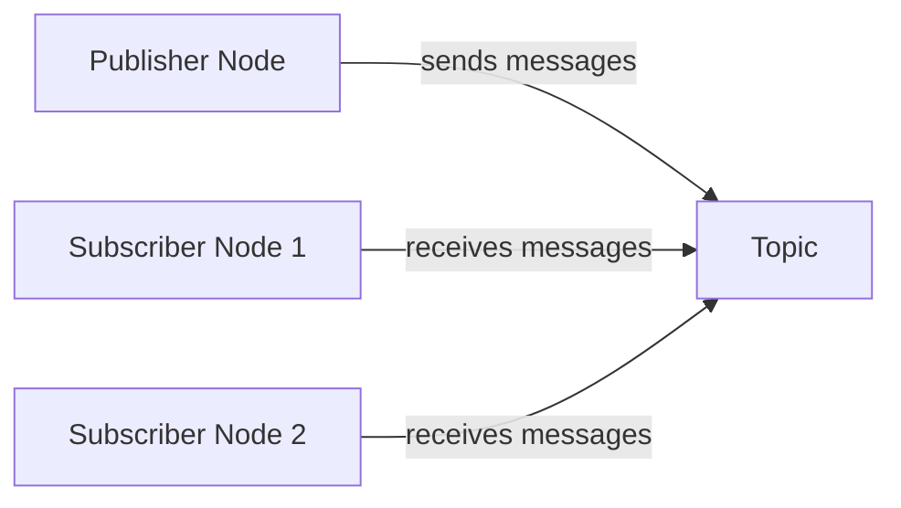

# 3. ROS 2 Fundamentals

import Tabs from '@theme/Tabs';
import TabItem from '@theme/TabItem';
import {Callout} from '@site/src/components/Callout';

## 3.1 Introduction to ROS 2

The Robot Operating System 2 (ROS 2) represents a revolutionary framework for developing robotic applications. Unlike traditional operating systems, ROS 2 provides a collection of tools, libraries, and conventions that streamline the development of complex robotic systems.

<Callout type="info">
**Key Insight:** ROS 2 is not an actual operating system but rather a middleware framework that provides services designed for robotic applications, including hardware abstraction, device drivers, libraries, visualizers, message-passing, package management, and more.
</Callout>

### 3.1.1 Why ROS 2 Matters

ROS 2 has become the de facto standard for robotic development due to several compelling advantages:

- **Modularity**: Components can be developed, tested, and maintained independently
- **Reusability**: Code can be shared and reused across different robotic platforms
- **Community Support**: A vast ecosystem of packages and active community
- **Real-time Capabilities**: Enhanced support for real-time systems
- **Security**: Built-in security features for safe robotic operations

### 3.1.2 Evolution from ROS 1 to ROS 2

ROS 2 addresses critical limitations of its predecessor:

<Tabs>
<TabItem value="architecture" label="Architecture" default>
- **ROS 1**: Centralized master-based architecture
- **ROS 2**: Decentralized, peer-to-peer architecture using DDS
</TabItem>
<TabItem value="realtime" label="Real-time">
- **ROS 1**: Limited real-time support
- **ROS 2**: Enhanced real-time capabilities
</TabItem>
<TabItem value="security" label="Security">
- **ROS 1**: No built-in security
- **ROS 2**: Comprehensive security framework
</TabItem>
</Tabs>

## 3.2 ROS 2 Architecture & Concepts

Understanding the fundamental architecture of ROS 2 is crucial for effective robotic development.

### 3.2.1 Core Architecture Components

<div className="feature-card">

#### 🤖 **Nodes**
The fundamental building blocks of ROS 2 applications:
- Independent processes that perform specific functions
- Communicate with other nodes through topics, services, and actions
- Can be written in multiple languages (C++, Python, etc.)

</div>

<div className="feature-card">

#### 📡 **Topics & Publishers/Subscribers**
Asynchronous communication mechanism:
- **Publishers**: Send data to topics
- **Subscribers**: Receive data from topics
- **Communication**: Many-to-many, fire-and-forget

</div>

<div className="feature-card">

#### 🔄 **Services**
Synchronous request-response communication:
- **Client**: Sends request and waits for response
- **Server**: Processes request and sends response back
- **Use Case**: Actions requiring confirmation or computation

</div>

<div className="feature-card">

#### 🎯 **Actions**
Long-running tasks with feedback:
- **Goal**: Request for long-running task
- **Feedback**: Continuous updates during execution
- **Result**: Final outcome when task completes

</div>

### 3.2.2 Communication Patterns

#### Topic-Based Communication


**Characteristics**:
- **Decoupled**: Publishers and subscribers don't need to know about each other
- **Real-time**: Messages sent as soon as available
- **Multiple subscribers**: One publisher can have many subscribers

#### Service-Based Communication
**Characteristics**:
- **Synchronous**: Client waits for server response
- **Reliable**: Request-response guarantee
- **Blocking**: Client blocks until response received

## 3.3 Setting Up Your ROS 2 Environment

### 3.3.1 Installation & Workspace Creation

#### Installing ROS 2
ROS 2 supports multiple distributions, with the latest being **Humble Hawksbill** (LTS) for Ubuntu 22.04:

```bash
# Add ROS 2 GPG key and repository
sudo apt update && sudo apt install curl gnupg lsb-release
sudo curl -sSL https://raw.githubusercontent.com/ros/rosdistro/master/ros.key -o /usr/share/keyrings/ros-archive-keyring.gpg

echo "deb [arch=$(dpkg --print-architecture) signed-by=/usr/share/keyrings/ros-archive-keyring.gpg] http://packages.ros.org/ros2/ubuntu $(source /etc/os-release && echo $UBUNTU_CODENAME) main" | sudo tee /etc/apt/sources.list.d/ros2.list > /dev/null

sudo apt update
sudo apt install ros-humble-desktop
```

#### Creating a Workspace
```bash
# Create workspace directory
mkdir -p ~/ros2_ws/src
cd ~/ros2_ws

# Source ROS 2 environment
source /opt/ros/humble/setup.bash

# Build the workspace
colcon build

# Source the workspace
source install/setup.bash
```

### 3.3.2 Essential ROS 2 Commands

<Tabs>
<TabItem value="node" label="Node Management" default>
- `ros2 run <package_name> <executable_name>`: Run a node
- `ros2 node list`: List active nodes
- `ros2 node info <node_name>`: Get detailed node information
</TabItem>
<TabItem value="topic" label="Topic Operations">
- `ros2 topic list`: List all active topics
- `ros2 topic echo <topic_name>`: Display messages on a topic
- `ros2 topic pub <topic_name> <msg_type> <args>`: Publish to a topic
</TabItem>
<TabItem value="service" label="Service Operations">
- `ros2 service list`: List all active services
- `ros2 service call <service_name> <service_type> <args>`: Call a service
</TabItem>
</Tabs>

## 3.4 Creating Your First ROS 2 Package

### 3.4.1 Package Structure

A typical ROS 2 package follows this structure:

```
my_robot_package/
├── CMakeLists.txt          # Build configuration for C++
├── package.xml            # Package metadata
├── src/                   # Source code
│   ├── publisher_node.cpp
│   └── subscriber_node.cpp
├── include/               # Header files
├── launch/                # Launch files
│   └── robot_launch.py
├── config/                # Configuration files
└── test/                  # Test files
```

### 3.4.2 Creating a Simple Publisher

Let's create a basic publisher that sends robot status messages:

**C++ Example:**
```cpp
#include "rclcpp/rclcpp.hpp"
#include "std_msgs/msg/string.hpp"

class MinimalPublisher : public rclcpp::Node
{
public:
    MinimalPublisher()
    : Node("robot_status_publisher"), count_(0)
    {
        publisher_ = this->create_publisher<std_msgs::msg::String>("robot_status", 10);
        timer_ = this->create_wall_timer(
            500ms, std::bind(&MinimalPublisher::timer_callback, this));
    }

private:
    void timer_callback()
    {
        auto message = std_msgs::msg::String();
        message.data = "Robot is operational - " + std::to_string(count_++);
        RCLCPP_INFO(this->get_logger(), "Publishing: '%s'", message.data.c_str());
        publisher_->publish(message);
    }
    rclcpp::TimerBase::SharedPtr timer_;
    rclcpp::Publisher<std_msgs::msg::String>::SharedPtr publisher_;
    size_t count_;
};

int main(int argc, char * argv[])
{
    rclcpp::init(argc, argv);
    rclcpp::spin(std::make_shared<MinimalPublisher>());
    rclcpp::shutdown();
    return 0;
}
```

**Python Example:**
```python
import rclpy
from rclpy.node import Node
from std_msgs.msg import String

class MinimalPublisher(Node):
    def __init__(self):
        super().__init__('robot_status_publisher')
        self.publisher_ = self.create_publisher(String, 'robot_status', 10)
        timer_period = 0.5  # seconds
        self.timer = self.create_timer(timer_period, self.timer_callback)
        self.i = 0

    def timer_callback(self):
        msg = String()
        msg.data = f'Robot is operational - {self.i}'
        self.publisher_.publish(msg)
        self.get_logger().info(f'Publishing: "{msg.data}"')
        self.i += 1

def main(args=None):
    rclpy.init(args=args)
    minimal_publisher = MinimalPublisher()
    rclpy.spin(minimal_publisher)
    minimal_publisher.destroy_node()
    rclpy.shutdown()

if __name__ == '__main__':
    main()
```

### 3.4.3 Creating a Matching Subscriber

**C++ Subscriber:**
```cpp
#include "rclcpp/rclcpp.hpp"
#include "std_msgs/msg/string.hpp"

class MinimalSubscriber : public rclcpp::Node
{
public:
    MinimalSubscriber()
    : Node("robot_status_subscriber")
    {
        subscription_ = this->create_subscription<std_msgs::msg::String>(
            "robot_status", 10,
            [this](const std_msgs::msg::String::SharedPtr msg) {
                RCLCPP_INFO(this->get_logger(), "Robot Status: '%s'", msg->data.c_str());
            });
    }

private:
    rclcpp::Subscription<std_msgs::msg::String>::SharedPtr subscription_;
};

int main(int argc, char * argv[])
{
    rclcpp::init(argc, argv);
    rclcpp::spin(std::make_shared<MinimalSubscriber>());
    rclcpp::shutdown();
    return 0;
}
```

## 3.5 Advanced ROS 2 Concepts

### 3.5.1 Launch Files

Launch files allow you to start multiple nodes with a single command:

**Python Launch File (launch/robot_system.launch.py):**
```python
from launch import LaunchDescription
from launch_ros.actions import Node

def generate_launch_description():
    return LaunchDescription([
        Node(
            package='my_robot_package',
            executable='status_publisher',
            name='robot_status_publisher',
            output='screen'
        ),
        Node(
            package='my_robot_package',
            executable='status_subscriber',
            name='robot_status_subscriber',
            output='screen'
        ),
        Node(
            package='rviz2',
            executable='rviz2',
            name='rviz',
            output='screen'
        )
    ])
```

### 3.5.2 Parameters & Configuration

ROS 2 allows runtime configuration through parameters:

```python
class RobotController(Node):
    def __init__(self):
        super().__init__('robot_controller')

        # Declare parameters with default values
        self.declare_parameter('max_velocity', 1.0)
        self.declare_parameter('wheel_radius', 0.1)

        # Get parameter values
        self.max_velocity = self.get_parameter('max_velocity').value
        self.wheel_radius = self.get_parameter('wheel_radius').value
```

### 3.5.3 Quality of Service (QoS)

QoS settings control how messages are delivered:

```python
from rclpy.qos import QoSProfile, QoSDurabilityPolicy, QoSHistoryPolicy, QoSReliabilityPolicy

# Configure QoS for critical messages
qos_profile = QoSProfile(
    history=QoSHistoryPolicy.KEEP_LAST,
    depth=10,
    reliability=QoSReliabilityPolicy.RELIABLE,
    durability=QoSDurabilityPolicy.VOLATILE
)

publisher = self.create_publisher(String, 'critical_commands', qos_profile)
```

## 3.6 ROS 2 for Humanoid Robotics

### 3.6.1 Specialized Packages for Humanoid Robots

ROS 2 provides several packages specifically designed for humanoid robotics:

<div className="feature-card">

#### 🤖 ** humanoid_msgs**
Standard message types for humanoid-specific data:
- Joint states with additional fields
- Center of mass information
- Balance-related data
- Whole-body control commands

</div>

<div className="feature-card">

#### 🏃 ** humanoid_control**
Control frameworks for humanoid robots:
- Whole-body controllers
- Balance controllers
- Walking pattern generators
- Motion planning for humanoid robots

</div>

<div className="feature-card">

#### 🤲 ** manipulation_msgs**
Enhanced manipulation capabilities:
- Grasp planning messages
- Dextrous manipulation commands
- Tool-use related messages

</div>

### 3.6.2 Integration with Humanoid Hardware

#### Joint Control Interface
```python
from control_msgs.msg import JointTrajectoryControllerState
from trajectory_msgs.msg import JointTrajectory, JointTrajectoryPoint

class HumanoidController(Node):
    def __init__(self):
        super().__init__('humanoid_controller')

        # Publishers for different body parts
        self.left_arm_pub = self.create_publisher(JointTrajectory, '/left_arm_controller/joint_trajectory', 10)
        self.right_arm_pub = self.create_publisher(JointTrajectory, '/right_arm_controller/joint_trajectory', 10)
        self.torso_pub = self.create_publisher(JointTrajectory, '/torso_controller/joint_trajectory', 10)

        # Subscribers for sensor feedback
        self.joint_state_sub = self.create_subscription(
            JointTrajectoryControllerState,
            '/joint_states',
            self.joint_state_callback,
            10
        )
```

#### Balance Control Integration
```python
from geometry_msgs.msg import Point, Vector3
from std_msgs.msg import Float64

class BalanceController(Node):
    def __init__(self):
        super().__init__('balance_controller')

        # ZMP (Zero Moment Point) publishers
        self.zmp_pub = self.create_publisher(Point, '/balance/zmp', 10)
        self.com_pub = self.create_publisher(Point, '/balance/com', 10)

        # Balance control commands
        self.balance_cmd_pub = self.create_publisher(Float64, '/balance/control_effort', 10)
```

<Callout type="tip">
**Best Practice:** When developing for humanoid robots, organize your ROS 2 nodes by functional modules (e.g., walking, manipulation, perception) and use appropriate QoS settings for real-time control.
</Callout>

## 3.7 Debugging & Visualization Tools

### 3.7.1 Essential ROS 2 Tools

<Tabs>
<TabItem value="rqt" label="rqt" default>
**rqt**: GUI-based tool for visualizing and debugging ROS 2 systems
- Node graph visualization
- Topic monitoring
- Parameter editing
- Message publishing
</TabItem>
<TabItem value="rviz" label="RViz2">
**RViz2**: 3D visualization tool for robotics
- Robot model visualization
- Sensor data visualization
- Path planning visualization
- TF tree visualization
</TabItem>
<TabItem value="rosbag" label="Rosbag2">
**Rosbag2**: Data recording and playback
- Record sensor data and messages
- Playback for testing
- Data analysis
</TabItem>
</Tabs>

### 3.7.2 Performance Monitoring

```bash
# Monitor node performance
ros2 run topicos topic_hz /robot_status

# Monitor CPU usage
ros2 run topicos node_cpu_monitor

# Analyze message delays
ros2 topic delay /sensor_data
```

---
**Chapter Summary**: This chapter introduced the fundamental concepts of ROS 2, from basic architecture to advanced topics specifically relevant to humanoid robotics. We explored nodes, topics, services, and actions - the core communication mechanisms that make ROS 2 powerful. We also covered practical aspects like creating packages, launch files, and specialized tools for humanoid robot development. Understanding these concepts is essential for building robust and maintainable robotic applications.