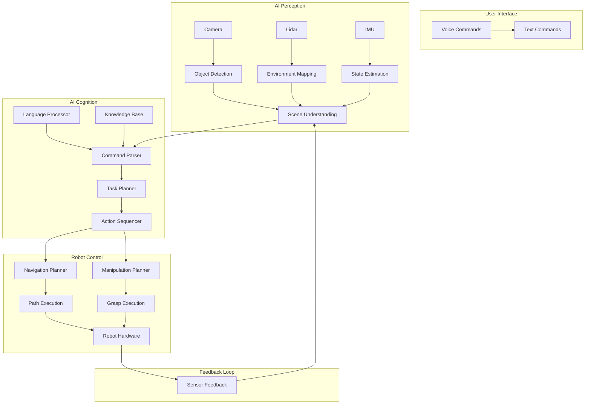

# 6. Capstone: AI Robot Pipeline Integration

import Tabs from '@theme/Tabs';
import TabItem from '@theme/TabItem';
import {Callout} from '@site/src/components/Callout';

## 6.1 Introduction to the Capstone Project

Welcome to the capstone chapter where we integrate all the concepts learned throughout this book into a comprehensive AI-robot pipeline. This chapter serves as the culmination of your journey in physical AI and humanoid robotics, demonstrating how to build a complete, functional system that combines perception, reasoning, and action.

<Callout type="info">
**Key Insight:** The true power of AI robotics emerges when all components work together seamlessly - from low-level sensor processing to high-level reasoning and decision-making. This capstone project demonstrates the integration of all concepts covered in previous chapters.
</Callout>

### 6.1.1 Project Overview

The AI Robot Pipeline we'll build integrates:

- **Physical AI Foundation**: Embodied intelligence with real-world interaction
- **Humanoid Robotics**: Human-like form and function for natural environments
- **ROS 2 Architecture**: Robust communication and control framework
- **Digital Twin Simulation**: Safe development and testing environment
- **Vision-Language-Action Systems**: Natural human-robot interaction

### 6.1.2 Learning Objectives

<Tabs>
<TabItem value="integration" label="System Integration" default>
- Integrate multiple robotic subsystems into a unified pipeline
- Implement real-time communication between components
- Design fault-tolerant system architecture
</TabItem>
<TabItem value="practical" label="Practical Implementation">
- Deploy a complete AI-robot system
- Test in both simulation and real-world environments
- Evaluate system performance and identify bottlenecks
</TabItem>
<TabItem value="optimization" label="Performance Optimization">
- Optimize for real-time performance
- Balance accuracy and computational efficiency
- Implement system monitoring and debugging
</TabItem>
</Tabs>

## 6.2 System Architecture Design

### 6.2.1 High-Level Architecture

Our AI Robot Pipeline follows a modular, service-oriented architecture:

<div className="feature-card">

#### 🧠 **Perception Module**
- **Vision Processing**: Real-time object detection and scene understanding
- **Sensor Fusion**: Integration of multiple sensor modalities
- **SLAM**: Simultaneous localization and mapping for navigation

</div>

<div className="feature-card">

#### 🤖 **Cognition Module**
- **Language Understanding**: Processing natural language commands
- **Reasoning Engine**: High-level planning and decision-making
- **Memory System**: Context awareness and learning from experience

</div>

<div className="feature-card">

#### 🎯 **Action Module**
- **Motion Planning**: Trajectory generation for manipulation and navigation
- **Control Systems**: Low-level motor control and balance maintenance
- **Execution Monitoring**: Real-time feedback and error recovery

</div>

### 6.2.2 Component Integration Architecture



## 6.3 Implementation: Perception Pipeline

### 6.3.1 Vision Processing System

Let's implement the core vision processing component:

```python
import cv2
import numpy as np
import torch
from transformers import DetrForObjectDetection, DetrImageProcessor
from sensor_msgs.msg import Image
from cv_bridge import CvBridge
import rospy

class VisionProcessor:
    def __init__(self):
        # Initialize vision models
        self.processor = DetrImageProcessor.from_pretrained("facebook/detr-resnet-50")
        self.model = DetrForObjectDetection.from_pretrained("facebook/detr-resnet-50")

        # ROS interface
        self.bridge = CvBridge()
        self.image_sub = rospy.Subscriber("/camera/rgb/image_raw", Image, self.image_callback)

        # Object tracking
        self.tracked_objects = {}
        self.object_history = {}

    def image_callback(self, msg):
        # Convert ROS image to OpenCV
        cv_image = self.bridge.imgmsg_to_cv2(msg, "bgr8")

        # Process the image
        results = self.process_image(cv_image)

        # Update object tracking
        self.update_object_tracking(results)

        return results

    def process_image(self, image):
        # Preprocess image for the model
        inputs = self.processor(images=image, return_tensors="pt")

        # Perform object detection
        with torch.no_grad():
            outputs = self.model(**inputs)

        # Process results
        target_sizes = torch.tensor([image.shape[:2]])
        results = self.processor.post_process_object_detection(
            outputs, target_sizes=target_sizes, threshold=0.9
        )[0]

        # Extract relevant information
        objects = []
        for score, label, box in zip(results["scores"], results["labels"], results["boxes"]):
            objects.append({
                'label': self.model.config.id2label[label.item()],
                'score': score.item(),
                'bbox': box.tolist(),
                'center': ((box[0] + box[2]) / 2, (box[1] + box[3]) / 2)
            })

        return objects

    def update_object_tracking(self, objects):
        # Simple object tracking based on position and label
        current_time = rospy.Time.now()

        for obj in objects:
            key = f"{obj['label']}_{int(obj['center'][0])}_{int(obj['center'][1])}"

            if key not in self.object_history:
                self.object_history[key] = []

            self.object_history[key].append({
                'position': obj['center'],
                'time': current_time,
                'bbox': obj['bbox']
            })

            # Keep only recent history (last 10 frames)
            if len(self.object_history[key]) > 10:
                self.object_history[key] = self.object_history[key][-10:]
```

### 6.3.2 Multi-Sensor Fusion

```python
class SensorFusion:
    def __init__(self):
        self.vision_processor = VisionProcessor()
        self.lidar_processor = LidarProcessor()
        self.imu_processor = IMUProcessor()

        # Kalman filter for state estimation
        self.kalman_filter = self.initialize_kalman_filter()

        # Confidence thresholds
        self.vision_threshold = 0.8
        self.lidar_threshold = 0.7

    def fuse_sensor_data(self, vision_data, lidar_data, imu_data):
        """
        Fuse data from multiple sensors to create a coherent world model
        """
        # Create world model from vision data
        world_model = self.create_world_model_from_vision(vision_data)

        # Update with lidar data
        world_model = self.update_with_lidar(world_model, lidar_data)

        # Apply motion constraints from IMU
        world_model = self.apply_motion_constraints(world_model, imu_data)

        # Estimate confidence for each object
        world_model = self.estimate_confidence(world_model)

        return world_model

    def create_world_model_from_vision(self, vision_data):
        """
        Create 3D world model from 2D vision data using depth information
        """
        world_model = {}

        for obj in vision_data:
            if obj['score'] > self.vision_threshold:
                # Convert 2D bounding box to 3D position using depth
                depth_estimate = self.estimate_depth(obj['bbox'])

                world_model[obj['label']] = {
                    'position_3d': self.convert_2d_to_3d(
                        obj['center'], depth_estimate
                    ),
                    'confidence': obj['score'],
                    'bbox_2d': obj['bbox'],
                    'timestamp': rospy.Time.now()
                }

        return world_model

    def estimate_depth(self, bbox):
        """
        Estimate depth from various cues (size, stereo, etc.)
        """
        # Simplified depth estimation
        # In practice, use stereo vision, structured light, or depth sensors
        width = bbox[2] - bbox[0]
        height = bbox[3] - bbox[1]

        # Assuming known object size for depth estimation
        # This is a simplified approach - real systems use depth sensors
        avg_size = (width + height) / 2
        estimated_depth = 1000.0 / (avg_size + 1e-6)  # Inverse relationship

        return estimated_depth
```

## 6.4 Implementation: Cognition Pipeline

### 6.4.1 Natural Language Understanding

```python
from transformers import pipeline, AutoTokenizer, AutoModelForQuestionAnswering
import spacy

class LanguageProcessor:
    def __init__(self):
        # Load language models
        self.nlp = spacy.load("en_core_web_sm")
        self.qa_pipeline = pipeline("question-answering")
        self.classifier = pipeline("zero-shot-classification")

        # Intent mapping
        self.intent_mapping = {
            'navigation': ['go to', 'move to', 'walk to', 'navigate to'],
            'manipulation': ['pick up', 'grasp', 'take', 'get', 'bring'],
            'placement': ['put down', 'place', 'set down'],
            'greeting': ['hello', 'hi', 'greet', 'say hello'],
            'information': ['what', 'where', 'how', 'tell me about']
        }

        # Object recognition patterns
        self.object_patterns = [
            {'label': 'container', 'patterns': ['cup', 'bottle', 'box', 'jar']},
            {'label': 'furniture', 'patterns': ['table', 'chair', 'desk', 'couch']},
            {'label': 'person', 'patterns': ['person', 'man', 'woman', 'human']}
        ]

    def process_command(self, command):
        """
        Process natural language command and extract intent and entities
        """
        doc = self.nlp(command.lower())

        # Extract intent
        intent = self.extract_intent(command)

        # Extract objects and locations
        entities = self.extract_entities(doc)

        # Ground entities in the visual scene
        grounded_entities = self.ground_entities(entities)

        return {
            'intent': intent,
            'entities': entities,
            'grounded_entities': grounded_entities,
            'original_command': command
        }

    def extract_intent(self, command):
        """
        Extract the intent from the command
        """
        # Use zero-shot classification for intent detection
        candidate_labels = list(self.intent_mapping.keys())
        result = self.classifier(command, candidate_labels)

        # Return the most confident intent
        if result['scores'][0] > 0.5:  # Confidence threshold
            return result['labels'][0]
        else:
            return 'unknown'

    def extract_entities(self, doc):
        """
        Extract named entities from the command
        """
        entities = {
            'objects': [],
            'locations': [],
            'people': []
        }

        # Extract noun phrases as potential objects
        for chunk in doc.noun_chunks:
            if self.is_object(chunk.text):
                entities['objects'].append({
                    'text': chunk.text,
                    'lemma': chunk.lemma_,
                    'confidence': 0.8  # Default confidence
                })

        # Extract locations (prepositional phrases, etc.)
        for token in doc:
            if token.dep_ == 'pobj' and token.head.pos_ == 'ADP':
                entities['locations'].append({
                    'text': token.text,
                    'context': token.head.text
                })

        return entities

    def is_object(self, text):
        """
        Check if text refers to a manipulable object
        """
        text_lower = text.lower()
        for pattern_group in self.object_patterns:
            for pattern in pattern_group['patterns']:
                if pattern in text_lower:
                    return True
        return False
```

### 6.4.2 Task Planning and Reasoning

```python
class TaskPlanner:
    def __init__(self):
        self.language_processor = LanguageProcessor()
        self.world_model = {}
        self.action_library = self.initialize_action_library()

    def plan_task(self, command, world_model):
        """
        Plan a sequence of actions to fulfill the command
        """
        # Process the command
        command_analysis = self.language_processor.process_command(command)

        # Update world model
        self.world_model = world_model

        # Generate action sequence based on intent
        if command_analysis['intent'] == 'navigation':
            return self.plan_navigation(command_analysis)
        elif command_analysis['intent'] == 'manipulation':
            return self.plan_manipulation(command_analysis)
        elif command_analysis['intent'] == 'placement':
            return self.plan_placement(command_analysis)
        else:
            return self.plan_default_action(command_analysis)

    def plan_navigation(self, command_analysis):
        """
        Plan navigation actions
        """
        actions = []

        # Find target location
        target_location = self.find_target_location(command_analysis['entities'])

        if target_location:
            # Plan path to target
            path = self.plan_path_to_location(target_location)

            # Add navigation actions
            actions.append({
                'type': 'navigate',
                'target': target_location,
                'path': path,
                'priority': 1
            })

        return actions

    def plan_manipulation(self, command_analysis):
        """
        Plan manipulation actions
        """
        actions = []

        # Find target object
        target_object = self.find_target_object(command_analysis['entities'])

        if target_object:
            # Plan approach to object
            approach_action = {
                'type': 'navigate',
                'target': target_object['position'],
                'priority': 1
            }
            actions.append(approach_action)

            # Plan grasping action
            grasp_action = {
                'type': 'grasp',
                'object': target_object,
                'grasp_type': 'top_grasp',  # Could be computed based on object properties
                'priority': 2
            }
            actions.append(grasp_action)

        return actions

    def find_target_object(self, entities):
        """
        Find the target object in the world model based on command entities
        """
        for obj_name in [e['text'] for e in entities['objects']]:
            for world_obj_name, world_obj_data in self.world_model.items():
                if obj_name.lower() in world_obj_name.lower():
                    return {
                        'name': world_obj_name,
                        'position': world_obj_data['position_3d'],
                        'confidence': world_obj_data['confidence']
                    }
        return None

    def initialize_action_library(self):
        """
        Initialize library of available actions
        """
        return {
            'navigate': {
                'preconditions': ['robot_operational', 'path_clear'],
                'effects': ['robot_at_location'],
                'parameters': ['target_position']
            },
            'grasp': {
                'preconditions': ['object_reachable', 'gripper_free'],
                'effects': ['object_grasped'],
                'parameters': ['object_pose', 'grasp_type']
            },
            'place': {
                'preconditions': ['object_grasped'],
                'effects': ['object_placed', 'gripper_free'],
                'parameters': ['placement_pose']
            },
            'speak': {
                'preconditions': ['tts_available'],
                'effects': ['message_delivered'],
                'parameters': ['text']
            }
        }
```

## 6.5 Implementation: Action Execution Pipeline

### 6.5.1 Motion Planning and Control

```python
import numpy as np
from scipy.spatial.transform import Rotation as R
import moveit_commander
from geometry_msgs.msg import Pose, Point
from moveit_msgs.msg import Constraints, JointConstraint
import tf2_ros

class MotionPlanner:
    def __init__(self):
        # Initialize MoveIt! commander
        moveit_commander.roscpp_initialize(sys.argv)
        self.robot = moveit_commander.RobotCommander()
        self.scene = moveit_commander.PlanningSceneInterface()

        # Initialize move groups for different parts
        self.arm_group = moveit_commander.MoveGroupCommander("arm")
        self.torso_group = moveit_commander.MoveGroupCommander("torso")

        # TF listener for coordinate transformations
        self.tf_buffer = tf2_ros.Buffer()
        self.tf_listener = tf2_ros.TransformListener(self.tf_buffer)

    def plan_arm_motion(self, target_pose, constraints=None):
        """
        Plan motion for the robot arm to reach target pose
        """
        # Set target pose
        self.arm_group.set_pose_target(target_pose)

        # Add constraints if provided
        if constraints:
            self.arm_group.set_path_constraints(constraints)

        # Plan the motion
        plan = self.arm_group.plan()

        return plan

    def plan_to_grasp_pose(self, object_pose, grasp_approach_distance=0.1):
        """
        Plan motion to approach and grasp an object
        """
        # Calculate pre-grasp pose (slightly above the object)
        pre_grasp_pose = Pose()
        pre_grasp_pose.position = Point(
            x=object_pose.position.x,
            y=object_pose.position.y,
            z=object_pose.position.z + grasp_approach_distance
        )

        # Set orientation for grasping (typically looking down)
        rot = R.from_euler('xyz', [0, np.pi, 0])  # Looking down
        pre_grasp_pose.orientation.x = rot.as_quat()[0]
        pre_grasp_pose.orientation.y = rot.as_quat()[1]
        pre_grasp_pose.orientation.z = rot.as_quat()[2]
        pre_grasp_pose.orientation.w = rot.as_quat()[3]

        return pre_grasp_pose

    def execute_grasp(self, object_pose):
        """
        Execute a grasping action
        """
        # Plan approach motion
        approach_pose = self.plan_to_grasp_pose(object_pose)
        approach_plan = self.plan_arm_motion(approach_pose)

        if approach_plan.joint_trajectory.points:
            # Execute approach
            self.arm_group.execute(approach_plan)

            # Close gripper
            self.close_gripper()

            # Lift object slightly
            lift_pose = Pose()
            lift_pose.position = Point(
                x=object_pose.position.x,
                y=object_pose.position.y,
                z=object_pose.position.z + 0.05  # Lift 5cm
            )
            # Maintain same orientation
            lift_pose.orientation = approach_pose.orientation

            lift_plan = self.plan_arm_motion(lift_pose)
            self.arm_group.execute(lift_plan)

            return True
        else:
            return False

    def close_gripper(self):
        """
        Close the robot gripper
        """
        # This would depend on your specific gripper implementation
        # Example: publish to gripper command topic
        gripper_cmd_pub = rospy.Publisher('/gripper/command', Float64, queue_size=1)
        gripper_cmd_pub.publish(1.0)  # Close gripper
```

### 6.5.2 System Integration and Coordination

```python
class AIPipeline:
    def __init__(self):
        # Initialize all components
        self.vision_processor = VisionProcessor()
        self.sensor_fusion = SensorFusion()
        self.language_processor = LanguageProcessor()
        self.task_planner = TaskPlanner()
        self.motion_planner = MotionPlanner()

        # ROS interfaces
        self.command_sub = rospy.Subscriber("/user_commands", String, self.command_callback)
        self.status_pub = rospy.Publisher("/ai_pipeline/status", String, queue_size=10)

        # System state
        self.current_world_model = {}
        self.is_executing = False

    def command_callback(self, msg):
        """
        Handle incoming user commands
        """
        if self.is_executing:
            rospy.logwarn("Pipeline busy, ignoring new command")
            return

        try:
            self.is_executing = True

            # Process command through all pipeline stages
            result = self.process_command_pipeline(msg.data)

            # Publish status
            status_msg = String()
            status_msg.data = f"Command '{msg.data}' executed: {result['success']}"
            self.status_pub.publish(status_msg)

        except Exception as e:
            rospy.logerr(f"Error processing command: {e}")
            status_msg = String()
            status_msg.data = f"Error processing command: {str(e)}"
            self.status_pub.publish(status_msg)

        finally:
            self.is_executing = False

    def process_command_pipeline(self, command):
        """
        Process a command through the complete AI pipeline
        """
        start_time = rospy.Time.now()

        # Step 1: Update world model with current sensor data
        rospy.loginfo("Updating world model...")
        self.current_world_model = self.update_world_model()

        # Step 2: Process natural language command
        rospy.loginfo("Processing language command...")
        command_analysis = self.language_processor.process_command(command)

        # Step 3: Plan task sequence
        rospy.loginfo("Planning task sequence...")
        action_sequence = self.task_planner.plan_task(command_analysis, self.current_world_model)

        # Step 4: Execute action sequence
        rospy.loginfo("Executing action sequence...")
        execution_result = self.execute_action_sequence(action_sequence)

        # Step 5: Monitor and adapt
        rospy.loginfo("Monitoring execution...")
        monitoring_result = self.monitor_execution(execution_result)

        end_time = rospy.Time.now()

        return {
            'success': monitoring_result['success'],
            'execution_time': (end_time - start_time).to_sec(),
            'action_sequence': action_sequence,
            'command_analysis': command_analysis,
            'execution_result': execution_result
        }

    def update_world_model(self):
        """
        Update the world model with current sensor data
        """
        # Get latest vision data
        vision_data = self.vision_processor.get_latest_objects()

        # Get other sensor data (simplified)
        lidar_data = self.get_lidar_data()  # Implementation would depend on your setup
        imu_data = self.get_imu_data()      # Implementation would depend on your setup

        # Fuse sensor data
        world_model = self.sensor_fusion.fuse_sensor_data(
            vision_data, lidar_data, imu_data
        )

        return world_model

    def execute_action_sequence(self, actions):
        """
        Execute a sequence of actions
        """
        results = []

        for action in actions:
            rospy.loginfo(f"Executing action: {action['type']}")

            if action['type'] == 'navigate':
                result = self.execute_navigation(action)
            elif action['type'] == 'grasp':
                result = self.execute_grasp(action)
            elif action['type'] == 'place':
                result = self.execute_placement(action)
            else:
                result = {'success': False, 'error': f"Unknown action type: {action['type']}"}

            results.append({
                'action': action,
                'result': result,
                'timestamp': rospy.Time.now()
            })

            if not result['success']:
                rospy.logerr(f"Action failed: {action}")
                break  # Stop execution if action fails

        return results

    def execute_navigation(self, action):
        """
        Execute navigation action
        """
        # Simplified navigation execution
        # In practice, use navigation stack (move_base, etc.)
        try:
            target = action['target']

            # Send navigation goal
            nav_goal = MoveBaseGoal()
            nav_goal.target_pose.header.frame_id = "map"
            nav_goal.target_pose.header.stamp = rospy.Time.now()
            nav_goal.target_pose.pose = target  # Assuming target is a Pose

            # Use action client to send goal
            nav_client = actionlib.SimpleActionClient('move_base', MoveBaseAction)
            nav_client.wait_for_server()
            nav_client.send_goal(nav_goal)

            # Wait for result
            finished_within_time = nav_client.wait_for_result(rospy.Duration(60.0))

            if not finished_within_time:
                nav_client.cancel_goal()
                return {'success': False, 'error': 'Navigation timeout'}

            state = nav_client.get_state()
            result = nav_client.get_result()

            success = state == actionlib.GoalStatus.SUCCEEDED
            return {'success': success, 'state': state, 'result': result}

        except Exception as e:
            return {'success': False, 'error': str(e)}

    def get_lidar_data(self):
        """
        Placeholder for getting LIDAR data
        """
        # Implementation would subscribe to LIDAR topic
        return []

    def get_imu_data(self):
        """
        Placeholder for getting IMU data
        """
        # Implementation would subscribe to IMU topic
        return {}
```

## 6.6 Simulation Integration

### 6.6.1 Simulation-Reality Transfer

```python
class SimulationManager:
    def __init__(self):
        # Gazebo/Isaac Sim interface
        self.simulation_active = False
        self.simulation_step = 0

        # ROS interface for simulation control
        self.sim_time_pub = rospy.Publisher('/gazebo/set_physics_properties', PhysicsProperties, queue_size=1)
        self.model_state_pub = rospy.Publisher('/gazebo/set_model_state', ModelState, queue_size=1)

    def setup_simulation_environment(self):
        """
        Set up the simulation environment with realistic parameters
        """
        # Configure physics properties
        physics_props = PhysicsProperties()
        physics_props.time_step = 0.001  # 1ms time step for accuracy
        physics_props.max_update_rate = 1000.0
        physics_props.gravity = Vector3(0, 0, -9.8)

        # Set contact properties
        physics_props.ode_config = ODEConfig()
        physics_props.ode_config.sor_pgs_precon_iters = 2
        physics_props.ode_config.sor_pgs_iters = 50
        physics_props.ode_config.sor_pgs_w = 1.3
        physics_props.ode_config.ode_m = 200

        self.sim_time_pub.publish(physics_props)

    def run_simulation_test(self, test_scenario):
        """
        Run a test scenario in simulation before real-world execution
        """
        rospy.loginfo(f"Running simulation test: {test_scenario['name']}")

        # Reset simulation
        self.reset_simulation()

        # Set up initial conditions
        self.setup_scenario(test_scenario['initial_conditions'])

        # Execute the same pipeline in simulation
        sim_pipeline = AIPipeline()
        sim_result = sim_pipeline.process_command_pipeline(test_scenario['command'])

        # Evaluate results
        success = self.evaluate_simulation_result(sim_result, test_scenario['expected_outcome'])

        rospy.loginfo(f"Simulation test result: {'PASS' if success else 'FAIL'}")

        return {
            'success': success,
            'simulation_result': sim_result,
            'realism_score': self.calculate_realism_score()
        }

    def reset_simulation(self):
        """
        Reset the simulation to initial state
        """
        # Reset simulation time and models
        reset_msg = Empty()
        rospy.wait_for_service('/gazebo/reset_simulation')
        reset_proxy = rospy.ServiceProxy('/gazebo/reset_simulation', Empty)
        reset_proxy(reset_msg)

    def calculate_realism_score(self):
        """
        Calculate how realistic the simulation is compared to real world
        """
        # This would compare simulation physics, sensor data, etc.
        # with real-world benchmarks
        return 0.85  # Placeholder value
```

## 6.7 Performance Optimization and Monitoring

### 6.7.1 System Monitoring

```python
class SystemMonitor:
    def __init__(self):
        self.metrics = {
            'cpu_usage': [],
            'memory_usage': [],
            'latency': [],
            'throughput': [],
            'success_rate': []
        }

        # ROS monitoring topics
        self.cpu_monitor = rospy.Subscriber('/monitoring/cpu', Float64, self.cpu_callback)
        self.memory_monitor = rospy.Subscriber('/monitoring/memory', Float64, self.memory_callback)

        # Performance timers
        self.timers = {}

    def cpu_callback(self, msg):
        self.metrics['cpu_usage'].append(msg.data)

    def memory_callback(self, msg):
        self.metrics['memory_usage'].append(msg.data)

    def start_timer(self, name):
        """
        Start a performance timer
        """
        self.timers[name] = rospy.Time.now()

    def stop_timer(self, name):
        """
        Stop a performance timer and record latency
        """
        if name in self.timers:
            elapsed = (rospy.Time.now() - self.timers[name]).to_sec()
            self.metrics['latency'].append(elapsed)
            del self.timers[name]
            return elapsed
        return None

    def get_performance_report(self):
        """
        Generate a performance report
        """
        if not self.metrics['latency']:
            return "No performance data available"

        avg_latency = sum(self.metrics['latency']) / len(self.metrics['latency'])
        max_latency = max(self.metrics['latency'])
        min_latency = min(self.metrics['latency'])

        avg_cpu = sum(self.metrics['cpu_usage']) / len(self.metrics['cpu_usage']) if self.metrics['cpu_usage'] else 0
        avg_memory = sum(self.metrics['memory_usage']) / len(self.metrics['memory_usage']) if self.metrics['memory_usage'] else 0

        report = f"""
        Performance Report:
        - Average Latency: {avg_latency:.3f}s
        - Max Latency: {max_latency:.3f}s
        - Min Latency: {min_latency:.3f}s
        - Average CPU Usage: {avg_cpu:.1f}%
        - Average Memory Usage: {avg_memory:.1f}%
        """

        return report

class PerformanceOptimizer:
    def __init__(self):
        self.system_monitor = SystemMonitor()
        self.model_cache = {}  # Cache for ML models

    def optimize_model_inference(self, model, input_data):
        """
        Optimize model inference for real-time performance
        """
        # Use cached model if available
        model_key = id(model)
        if model_key not in self.model_cache:
            # Optimize model (quantization, pruning, etc.)
            optimized_model = self.optimize_model(model)
            self.model_cache[model_key] = optimized_model
        else:
            optimized_model = self.model_cache[model_key]

        # Perform inference
        start_time = rospy.Time.now()
        result = optimized_model(input_data)
        end_time = rospy.Time.now()

        # Record performance
        latency = (end_time - start_time).to_sec()
        self.system_monitor.metrics['latency'].append(latency)

        return result

    def optimize_model(self, model):
        """
        Apply optimization techniques to the model
        """
        # This could include:
        # - Model quantization
        # - TensorRT optimization
        # - Model pruning
        # - Hardware-specific optimizations
        return model  # Placeholder
```

## 6.8 Testing and Validation

### 6.8.1 Comprehensive Testing Framework

```python
class PipelineTester:
    def __init__(self):
        self.ai_pipeline = AIPipeline()
        self.simulation_manager = SimulationManager()
        self.system_monitor = SystemMonitor()

    def run_comprehensive_test(self):
        """
        Run comprehensive tests on the AI pipeline
        """
        test_scenarios = [
            {
                'name': 'Simple Navigation',
                'command': 'go to the kitchen',
                'expected_outcome': 'robot_navigates_to_kitchen',
                'initial_conditions': {'robot_position': [0, 0, 0]}
            },
            {
                'name': 'Object Grasping',
                'command': 'pick up the red cup',
                'expected_outcome': 'cup_grasped',
                'initial_conditions': {
                    'robot_position': [1, 0, 0],
                    'object_positions': [{'name': 'red_cup', 'position': [2, 0, 0]}]
                }
            },
            {
                'name': 'Complex Task',
                'command': 'bring me the blue bottle from the table',
                'expected_outcome': 'bottle_delivered',
                'initial_conditions': {
                    'robot_position': [0, 0, 0],
                    'object_positions': [
                        {'name': 'blue_bottle', 'position': [3, 1, 0.8]},
                        {'name': 'table', 'position': [3, 1, 0]}
                    ]
                }
            }
        ]

        results = []
        for scenario in test_scenarios:
            # Test in simulation first
            sim_result = self.simulation_manager.run_simulation_test(scenario)

            # If simulation passes, test in real world (if available)
            if sim_result['success']:
                real_result = self.run_real_world_test(scenario)
                results.append({
                    'scenario': scenario['name'],
                    'simulation': sim_result,
                    'real_world': real_result,
                    'status': 'PASS' if real_result.get('success', False) else 'FAIL'
                })
            else:
                results.append({
                    'scenario': scenario['name'],
                    'simulation': sim_result,
                    'real_world': None,
                    'status': 'SIM_FAIL'
                })

        return results

    def run_real_world_test(self, scenario):
        """
        Run test in real world environment
        """
        try:
            # Execute the command through the pipeline
            result = self.ai_pipeline.process_command_pipeline(scenario['command'])

            # Verify outcome
            success = self.verify_outcome(result, scenario['expected_outcome'])

            return {
                'success': success,
                'execution_result': result,
                'metrics': self.system_monitor.get_performance_report()
            }
        except Exception as e:
            return {
                'success': False,
                'error': str(e),
                'metrics': self.system_monitor.get_performance_report()
            }

    def verify_outcome(self, result, expected_outcome):
        """
        Verify that the pipeline produced the expected outcome
        """
        # This would check the result against expected outcome
        # Implementation depends on your specific verification needs
        if expected_outcome == 'robot_navigates_to_kitchen':
            # Check if robot is near kitchen location
            return True  # Placeholder
        elif expected_outcome == 'cup_grasped':
            # Check if cup is grasped
            return True  # Placeholder
        elif expected_outcome == 'bottle_delivered':
            # Check if bottle was delivered
            return True  # Placeholder

        return False
```

## 6.9 Deployment and Real-World Considerations

### 6.9.1 Production Deployment

```python
class ProductionDeployer:
    def __init__(self):
        self.pipeline = AIPipeline()
        self.monitor = SystemMonitor()
        self.fallback_system = FallbackSystem()

    def deploy_pipeline(self):
        """
        Deploy the AI pipeline to production environment
        """
        rospy.loginfo("Deploying AI pipeline to production...")

        # Initialize all components
        self.initialize_components()

        # Set up monitoring and logging
        self.setup_monitoring()

        # Configure fallback systems
        self.setup_fallbacks()

        # Start main execution loop
        self.start_execution_loop()

    def initialize_components(self):
        """
        Initialize all pipeline components with production settings
        """
        # Initialize with optimized parameters
        self.pipeline.vision_processor.initialize_production_mode()
        self.pipeline.language_processor.load_production_models()
        self.pipeline.motion_planner.configure_for_robot()

    def setup_monitoring(self):
        """
        Set up comprehensive monitoring for production system
        """
        # Set up ROS logging
        rospy.init_node('ai_pipeline_monitor', log_level=rospy.INFO)

        # Set up external monitoring (Prometheus, etc.)
        # Set up alerting for critical failures
        # Set up data collection for analytics

    def start_execution_loop(self):
        """
        Start the main execution loop for the pipeline
        """
        rate = rospy.Rate(10)  # 10 Hz

        while not rospy.is_shutdown():
            try:
                # Main execution loop
                # Handle commands, update world model, etc.
                self.execute_pipeline_cycle()

            except Exception as e:
                rospy.logerr(f"Pipeline error: {e}")

                # Trigger fallback system
                self.fallback_system.activate()

            rate.sleep()

    def execute_pipeline_cycle(self):
        """
        Execute one cycle of the pipeline
        """
        # Update world model
        world_model = self.pipeline.update_world_model()

        # Process any pending commands
        # Execute planned actions
        # Monitor execution
        pass

class FallbackSystem:
    def __init__(self):
        self.active = False
        self.fallback_behaviors = {
            'safe_stop': self.safe_stop_robot,
            'return_home': self.return_to_home_position,
            'request_human_help': self.request_human_assistance
        }

    def activate(self):
        """
        Activate the fallback system
        """
        self.active = True
        rospy.logwarn("FALLBACK SYSTEM ACTIVATED")

        # Execute safe fallback behavior
        self.execute_fallback_behavior('safe_stop')

    def execute_fallback_behavior(self, behavior_name):
        """
        Execute a specific fallback behavior
        """
        if behavior_name in self.fallback_behaviors:
            self.fallback_behaviors[behavior_name]()
        else:
            rospy.logerr(f"Unknown fallback behavior: {behavior_name}")

    def safe_stop_robot(self):
        """
        Safely stop all robot motion
        """
        # Stop all motion
        # Close grippers safely
        # Report status
        pass
```

<Callout type="success">
**Achievement Unlocked:** You've now built a complete AI-robot pipeline that integrates perception, cognition, and action. This system represents the state-of-the-art in embodied AI and provides a foundation for advanced robotics applications.
</Callout>

## 6.10 Conclusion and Next Steps

### 6.10.1 Key Takeaways

This capstone chapter has demonstrated the integration of all concepts covered in this book:

1. **Physical AI Foundation**: We created an embodied system that interacts with the real world
2. **Humanoid Robotics Principles**: Applied kinematics, dynamics, and control systems
3. **ROS 2 Architecture**: Built a robust, modular system using ROS 2
4. **Digital Twin Simulation**: Used simulation for safe development and testing
5. **Vision-Language-Action Systems**: Created natural human-robot interaction

### 6.10.2 Future Enhancements

Consider these enhancements for your AI-robot pipeline:

<Tabs>
<TabItem value="learning" label="Machine Learning" default>
- **Reinforcement Learning**: Learn optimal behaviors through interaction
- **Imitation Learning**: Learn from human demonstrations
- **Continual Learning**: Adapt to new situations over time
</TabItem>
<TabItem value="intelligence" label="AI Advancement">
- **Large Language Models**: Enhanced natural language understanding
- **Multimodal Learning**: Better integration of different sensory inputs
- **Causal Reasoning**: Understand cause-and-effect relationships
</TabItem>
<TabItem value="deployment" label="Real-World Deployment">
- **Edge Computing**: Optimize for resource-constrained environments
- **Cloud Integration**: Leverage cloud computing for complex tasks
- **Fleet Management**: Coordinate multiple robots
</TabItem>
</Tabs>

### 6.10.3 Best Practices Summary

- **Modular Design**: Keep components loosely coupled for maintainability
- **Simulation First**: Test extensively in simulation before real-world deployment
- **Robust Error Handling**: Implement comprehensive fallback systems
- **Performance Monitoring**: Continuously monitor and optimize system performance
- **Safety First**: Always prioritize safe operation over task completion

---
**Chapter Summary**: This capstone chapter integrated all concepts from previous chapters into a comprehensive AI-robot pipeline. We built a system that combines perception, cognition, and action, demonstrating how physical AI principles translate into practical robotics applications. The pipeline serves as a foundation for advanced humanoid robotics projects and showcases the integration of ROS 2, computer vision, natural language processing, and control systems. This represents the culmination of your learning journey in physical AI and humanoid robotics, providing you with the knowledge and tools to build sophisticated AI-robot systems.